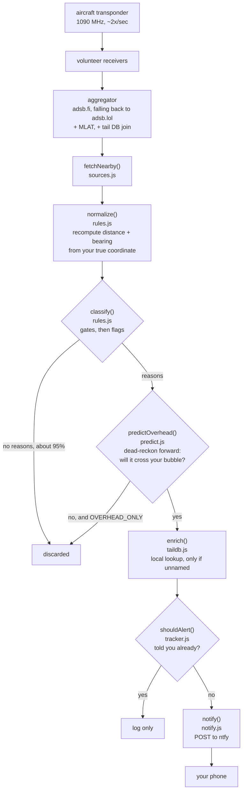

# look-up

**Pushes a notification to your phone when a military, unidentified, or privacy-blocked aircraft is overhead.**


Point it at a coordinate, leave it running, and it buzzes you when something
interesting is in your sky:

```
MILITARY - AF3FA3 (Boeing E-6B Mercury) 4 nm SSE

No callsign broadcast.
1,025 ft, 140 kt
4 nm away, bearing 160° SSE - look 2° up
(named from local tail database; the feed had no row)
Squawk 3651
https://globe.adsb.fi/?icao=af3fa3
```

No API keys, no accounts, no dependencies. About 1,000 lines of plain Node.

**New here? Start with the [setup guide](docs/setup.md)** — a step-by-step
walkthrough from nothing to a running alerter. This page is the reference.

---

## Contents

- [Quick start](#quick-start)
  - [Secrets](#secrets)
- [How it works](#how-it-works)
  - [1. What an aircraft actually broadcasts](#1-what-an-aircraft-actually-broadcasts)
  - [2. How you receive it without a receiver](#2-how-you-receive-it-without-a-receiver)
  - [3. The pipeline](#3-the-pipeline)
  - [4. Design notes](#4-design-notes)
- [Alert rules](#alert-rules)
- [Tuning the noise](#tuning-the-noise)
- [Configuration](#configuration)
- [Commands](#commands)
- [Limitations](#limitations)
- [Running continuously](#running-continuously)
- [Project layout](#project-layout)

---

## Quick start

```sh
npm run init
```

That creates `.env` from `.env.example` with a freshly generated, private ntfy
topic. Then set two things in `.env`:

| Key | What |
|---|---|
| `LAT` / `LON` | Your coordinate in decimal degrees. Long-press your house in any map app and copy the pair. |
| `RADIUS_NM` | How far out to care, in nautical miles. `10` is tight and genuinely overhead; `25` is a busier feed. |

Install [**ntfy**](https://ntfy.sh) (free, no account) and *Subscribe to topic*
using the string `npm run init` printed. Then:

```sh
npm run update-db    # one-time, ~8MB: the local tail database
npm run test-notify  # confirms your phone is wired up
npm run once         # one poll, prints what it sees, exits
npm start            # the real thing
```

There is no `npm install` step. There are no dependencies.

Stuck on any of it? The [setup guide](docs/setup.md) covers each step in detail,
plus troubleshooting.

### Secrets

Everything sensitive lives in `.env`, which is gitignored. `.env.example` is the
committed template and contains **no real values** — every secret field is blank.

| What | Where | Why it matters |
|---|---|---|
| `NTFY_TOPIC` | `.env` | Anyone who knows the string can read every alert you receive. It is a password, not a name. |
| `LAT` / `LON` | `.env` | Your home coordinate. |
| `NTFY_TOKEN`, `PUSHOVER_*` | `.env` | Ordinary API credentials. |
| `state.json` | gitignored | Records which aircraft passed overhead and when. |

> [!WARNING]
> Never paste a real topic into `.env.example`. If you have already shared or
> committed one, rotate it — generate a new topic, update `.env`, and
> re-subscribe in the app. The old topic cannot be revoked, only abandoned.
>
> ```sh
> node -e "console.log('lookup-'+require('crypto').randomBytes(6).toString('hex'))"
> ```

---

## How it works

### 1. What an aircraft actually broadcasts

Every ADS-B-equipped aircraft transmits in the clear on **1090 MHz, roughly twice
a second**. No encryption, no handshake — it is a beacon. Each message carries:

| Field | Notes |
|---|---|
| **ICAO address** | 24-bit hex (`AF3FA3`), burned in, permanent, one per airframe. The primary key for everything else. |
| **Callsign** | Crew-entered. Optional, and frequently blank. |
| **Position, altitude, velocity** | From the aircraft's own GPS. |
| **Squawk, emitter category** | Coarse class only: light / large / heavy / rotorcraft. |

Note what is **missing**: no type, no registration, no operator. *The sky does not
tell you what kind of plane it is.*

### 2. How you receive it without a receiver

A $30 USB dongle picks this up out of a window. Thousands of hobbyists do exactly
that and feed what they hear into shared pools. You query a pool instead of
running hardware.

Aggregators add two things on top of the raw broadcasts:

**MLAT.** Some aircraft transmit an ID but no position — older Mode S
transponders, and plenty of military. When four or more ground stations hear the
same reply, the differences in arrival time triangulate a position. Such records
are sparse and slightly stale by nature, and routinely carry no callsign.

**Database enrichment.** The aggregator joins the hex against a community tail
database to fill in type, registration, operator, and a `dbFlags` bitfield:

| Bit | Meaning |
|---|---|
| `1` | Military |
| `2` | Interesting |
| `4` | PIA — Privacy ICAO Address, a rotating anonymised hex |
| `8` | LADD — the FAA's Limiting Aircraft Data Displayed opt-out list |

**Those flags are database opinions, not radio facts.** So is the aircraft type.
This distinction is the source of nearly every surprise in this project.

### 3. The pipeline

Every `POLL_SECONDS`, one `poll()` runs in [`src/index.js`](src/index.js):



The ordering is deliberate: **cheap filters first, expensive lookups only on what
survives.** A typical poll normalizes ~80 aircraft, classifies all of them, and
performs zero database reads.

### 4. Design notes

<details>
<summary><b>Two-stage gating</b> — why "in range" means "you could actually see it"</summary>

<br>

`classify()` checks distance, altitude, ground state, and **elevation angle**
*before* looking at any flag. Elevation is the useful one:

```
elevation = atan(altitude / ground distance)
```

An airliner at 35,000 ft and 25 nm out is technically in range but sits **13°
above your horizon** — a speck. At 10 nm it is 30°, unmistakably overhead. Every
alert body reports it as `look 63° up`, so you know where to point your face.

The noisy no-callsign rule also fires *only* if nothing better already caught the
aircraft, so a military jet with a blank callsign is one alert, not two.

</details>

<details>
<summary><b>Overhead prediction</b> — dead reckoning into a cone</summary>

<br>

Being *near* you and being *visible* are different things, and the gap is
mostly vertical. Three separate constraints bound the sky you can actually see,
and each binds at a different altitude:

| | Constraint | Binds for |
|---|---|---|
| 1 | **Your horizon** — `elevation >= OVERHEAD_HORIZON_DEG`. Trees, roofs and terrain cut off the bottom of your sky. | **Low** aircraft |
| 2 | **"Overhead"** — `ground distance <= OVERHEAD_MAX_GROUND_NM`. However high it is, far away horizontally is not overhead. | **High** aircraft |
| 3 | **Resolvability** — `slant <= OVERHEAD_MAX_SLANT_NM`. Past that it is a dot. | Extremes only |
| 4 | **A cylinder**, unioned on — `ground <= OVERHEAD_CYLINDER_NM`, whatever the elevation. | **Very low** aircraft |

The cylinder exists because the cone is right about your eyes and wrong about
your ears. A helicopter at 400 ft beyond 0.37 nm *is* behind your treeline —
and it is still low, close and loud, and may well show through a gap. At 1 nm
the cylinder only reaches below **1,070 ft**, where the cone is narrower than
it is; above that the cone is already wider and the cylinder changes nothing.
It covers 0.028% of the 60 nm search area, so it cannot meaningfully add noise.
Alerts that qualify only via the cylinder say so: *"stays below your treeline —
close enough to hear, probably not to see."*

The horizon angle is **not a preference** — it is a fact about where you stand.
Roughly 5–15° in wooded suburbia, near 0° over open water, more in a valley.

A single elevation cone cannot do this job, and the first version of this
feature tried. At 45° a helicopter at 400 ft had to be within **0.066 nm — 133
yards** — while a jet at 30,000 ft got a 4.9 nm window. That is exactly
backwards: the low, close, loud aircraft is the one you are most likely to
notice, and it was the one being excluded.

Splitting the floor from the preference fixes both ends:

| Altitude | Old 45° cone | Horizon 10° + 3 nm cap | |
|---|---|---|---|
| 400 ft | 0.07 nm | **0.37 nm** | 5.7× wider |
| 1,000 ft | 0.16 nm | **0.93 nm** | 5.7× wider |
| 3,000 ft | 0.49 nm | **2.80 nm** | 5.7× wider |
| 10,000 ft | 1.65 nm | **3.00 nm** | 1.8× wider |
| 30,000 ft | 4.94 nm | **3.00 nm** | stricter |
| 40,000 ft | 6.58 nm | **3.00 nm** | stricter |

Low traffic gets caught; high traffic has to be more genuinely overhead.

[`predict.js`](src/predict.js) then dead-reckons each aircraft along its
current **ground track** (not heading) at its current speed and vertical rate,
out to `OVERHEAD_LOOKAHEAD_MIN`. Stepping rather than solving closed-form is
deliberate: the bubble's radius changes with altitude, so a climbing or
descending aircraft chases a moving target and there is no clean analytic
answer.

It runs **two passes**. A coarse one finds the crossing, with its step shrunk
adaptively — at 500 kt and 400 ft the whole crossing lasts 5 seconds, which a
fixed 5-second step would skip clean over. A fine pass then re-walks just that
window to pin down peak elevation and closest approach; without it, a
helicopter passing directly overhead reported its peak as 50° rather than 90°,
which would send you looking at the wrong patch of sky. The full test suite
runs in 3 ms.

Because approaching traffic is *far away* when it matters, prediction fetches a
much wider radius (`OVERHEAD_SEARCH_NM`, default 60) than the alert radius, and
tests flags directly rather than going through the distance-gated `classify()`.
Config validation rejects a search radius too small for the lookahead window,
since that makes aircraft materialise already on top of you.

**How selective is it?** A live run over one sky: 109 aircraft within 60 nm,
**2** whose tracks actually crossed the cone.

</details>

<details>
<summary><b>The straightness gate</b> — not projecting aircraft that are turning</summary>

<br>

Dead reckoning is only honest if the aircraft is actually flying straight, and
**one observation cannot tell you that**. A jet halfway round a turn looks
identical to a jet holding that heading — same position, same instantaneous
track — and extrapolating it produces a confidently wrong answer pointing at
the wrong part of the sky.

[`history.js`](src/history.js) keeps a rolling window of observations per hex
and measures the **net** heading change across it, divided by its duration.
Net rather than largest-step, because reporting jitter cancels itself out while
a sustained turn accumulates:

| Turn rate | What it is |
|---|---|
| 0.008°/s | ADS-B jitter on a genuinely straight track |
| 0.18°/s | a slow drift — still usable |
| 0.22°/s | rejected (`OVERHEAD_MAX_TURN_RATE`) |
| 0.83°/s | a standard-rate turn — projection would be nonsense |

Speed is checked too. An aircraft decelerating into an approach has the right
heading and the wrong *timing*, so a drift beyond `OVERHEAD_MAX_SPEED_DRIFT_PCT`
also vetoes the projection.

**The failure it exists to catch.** An aircraft sweeping through the heading
that happens to point at your house. For exactly one poll its instantaneous
track aims straight at you, and a naive projection promises a pass that will
never happen:

```
poll 0  track  15   naive: no crossing         | with gate: silent
poll 1  track  30   naive: no crossing         | with gate: silent
poll 2  track  45   naive: would alert T-3m56s | with gate: HELD (turning 0.50°/s)
poll 3  track  60   naive: no crossing         | with gate: silent
poll 4  track  75   naive: no crossing         | with gate: silent
```

Aircraft with too little history return "not yet" rather than "fine", so a
newly-appeared contact waits rather than being trusted. Headings wrap correctly:
355° → 5° is a 10° change, not 350°.

**The cost is lead time.** Samples arrive one per poll, so 3 samples at
`POLL_SECONDS=30` means about a minute of watching before anything can alert.
Config validation rejects a warm-up longer than the lookahead window outright,
since that combination could never produce an alert at all. Held-back aircraft
are logged as `(unsteady) CALLSIGN (warming up)` or `(turning 0.83°/s)` so you
can see the gate working rather than wonder why it went quiet.

</details>

<details>
<summary><b>The tracker</b> — why a stateless feed needs memory</summary>

<br>

The feed has no concept of "new". A jet loitering overhead appears in all 60
polls of the next half hour, and the naive version notifies you 60 times.

[`tracker.js`](src/tracker.js) keeps `hex -> {lastSeen, alertedAt, reasons}`. An
aircraft alerts once, then stays silent until it has been **gone** for
`REVISIT_MINUTES`. It re-alerts early only if it picks up a *new* reason, and
never more often than `RE_ALERT_MINUTES`.

State persists to `state.json`, so restarting the service does not replay the
entire sky at you.

</details>

<details>
<summary><b>The local tail database</b> — a freshness fix, not a better source</summary>

<br>

The aggregators' database snapshots go stale. The worked example: `AF3FA3` is a
US Navy **E-6B Mercury**, the TACAMO airborne command post. Both adsb.lol and
adsb.fi return *no type at all* for it — so the rarest thing in the sky would
have arrived on your phone looking like the most boring.

So `look-up` keeps its own copy of the same community database:

| | |
|---|---|
| Rows | 616,948, sorted by hex |
| On disk | 31 MB (8 MB download), refreshed every `TAILDB_MAX_AGE_DAYS` |
| Lookup | **binary search on disk**, ~2 ms |
| Memory | negligible — holding it in a `Map` measured 170 MB of heap |

Some rows carry a type code but no description (`AF3FA3` is literally just
`E6`). Rather than fetch another dataset, type names are derived **from the
database itself**: for each type code, the most common description across every
row that has one. That turns `E6` into `Boeing E-6B Mercury`, covering 1,773
type codes in a 48 KB index.

Anything still unnameable is labelled `(UNIDENTIFIED)`, says so plainly, and
links to ADSBExchange instead of the feed that just failed to identify it.

**An empty type field means "unknown", never "ordinary."**

</details>

---

## Alert rules

| Rule | Catches | Default |
|---|---|---|
| **Military** | `dbFlags` bit 1. Broad — it covers anything on a military registry, including base aero-club Cessnas. | `ALERT_MILITARY=true` |
| **No callsign** | Broadcasting a position but no flight ID. Gated tighter than the others, and skips MLAT/TIS-B. | `ALERT_NO_CALLSIGN=true` |
| **Interesting** | `dbFlags` bit 2. | `ALERT_INTERESTING=true` |
| **PIA** | `dbFlags` bit 4. Rotating anonymised addresses — the flag that catches genuinely privacy-blocked aircraft. | `ALERT_PIA=true` |
| **LADD** | `dbFlags` bit 8. **Off by default**: applied liberally and goes stale, so scheduled airliners routinely carry it. | `ALERT_LADD=false` |
| **Overhead** | Not a flag but a *filter*: dead-reckons each aircraft forward and keeps only those whose track crosses the patch of sky you can actually see. See below. | `OVERHEAD=true` |

---

## Tuning the noise

Two honest caveats, both visible on the first run:

- **The military flag is broad.** A test run over Beale AFB flagged a Cessna 172
  belonging to the *base flying club*. Correct per the data; probably not what
  you are watching for.
- **"No callsign" is common and usually boring.** Plenty of general aviation
  never sets a flight ID, and MLAT/TIS-B targets frequently have none because the
  position was derived by ground receivers rather than broadcast.

In rough order of effectiveness:

```ini
MIN_ELEVATION_DEG=30    # only things genuinely high in your sky
MAX_ALT_FT=20000        # drop airliners in cruise
RADIUS_NM=10            # tighten the circle
ALERT_NO_CALLSIGN=false # the noisiest remaining rule
```

A tight `RADIUS_NM` does most of the work `MIN_ELEVATION_DEG` was for — at 10 nm
even a cruising airliner is already 30° up.

---

## Configuration

Everything lives in `.env`. Blank means "no limit" for the numeric gates.

#### Location

| Key | Default | Meaning |
|---|---|---|
| `LAT`, `LON` | *required* | Your coordinate, decimal degrees. Only a 2-decimal rounding (~0.5 mi) is sent upstream; alert distances are computed locally from the exact value. |
| `RADIUS_NM` | `25` | Watch radius, 1–250. |

#### Push

| Key | Default | Meaning |
|---|---|---|
| `NTFY_TOPIC` | *one of these is required* | ntfy topic to publish to. |
| `NTFY_SERVER` | `https://ntfy.sh` | For self-hosted ntfy. |
| `NTFY_TOKEN` | — | Only for access-controlled servers. |
| `PUSHOVER_TOKEN`, `PUSHOVER_USER` | — | Pushover instead of, or as well as, ntfy. |

#### Rules

| Key | Default |
|---|---|
| `ALERT_MILITARY` | `true` |
| `ALERT_NO_CALLSIGN` | `true` |
| `ALERT_INTERESTING` | `true` |
| `ALERT_PIA` | `true` |
| `ALERT_LADD` | `false` |

#### Gates

| Key | Default | Meaning |
|---|---|---|
| `POLL_SECONDS` | `30` | Seconds between checks. Do not go below 15 — these feeds are volunteer-funded. |
| `IGNORE_GROUND` | `true` | Skip aircraft parked or taxiing. |
| `MAX_ALT_FT` | — | Ceiling in feet. |
| `MIN_ELEVATION_DEG` | — | Degrees above your horizon. `90` is straight up. |
| `NO_CALLSIGN_MAX_NM` | `10` | Tighter radius for the no-callsign rule only. |
| `NO_CALLSIGN_MAX_ALT_FT` | `15000` | Tighter ceiling for the same. |
| `NO_CALLSIGN_SKIP_MLAT_TISB` | `true` | Ignore second-hand positions, which usually lack a callsign for boring reasons. |

#### Overhead prediction

| Key | Default | Meaning |
|---|---|---|
| `OVERHEAD` | `true` | Enable dead-reckoning prediction. |
| `OVERHEAD_ONLY` | `true` | Alert *only* on predicted passes, suppressing plain in-radius alerts for aircraft that will never come overhead. |
| `OVERHEAD_SCOPE` | `flagged` | `flagged` projects only aircraft that trip a rule; `all` projects everything, airliners included. |
| `OVERHEAD_HORIZON_DEG` | `10` | Your treeline, in degrees above level. A fact about your location, not a taste setting. Decides whether you catch low traffic. |
| `OVERHEAD_MAX_GROUND_NM` | `3` | How far horizontally still counts as overhead. Decides how strict "overhead" is for high traffic. |
| `OVERHEAD_CYLINDER_NM` | `1` | Everything within this distance horizontally counts, whatever its elevation. Catches low traffic the treeline hides. `0` disables. |
| `OVERHEAD_MAX_SLANT_NM` | `25` | Beyond this it is an unresolvable dot. Rarely the binding constraint. |
| `OVERHEAD_LOOKAHEAD_MIN` | `6` | How far ahead to project. More warning, less accuracy. |
| `OVERHEAD_STEP_SECONDS` | `5` | Simulation resolution. |
| `OVERHEAD_MIN_SPEED_KT` | `40` | Ignore hovering or taxiing aircraft, which cannot be dead-reckoned. |
| `OVERHEAD_SEARCH_NM` | `60` | Fetch radius. Must cover `~500kt × lookahead`, and validation enforces it. |
| `OVERHEAD_REQUIRE_STRAIGHT` | `true` | Only project aircraft that have held a steady track across several polls. |
| `OVERHEAD_MIN_SAMPLES` | `3` | Observations needed before judging. Costs `(n-1) × POLL_SECONDS` of lead time. |
| `OVERHEAD_MIN_SPAN_SECONDS` | `45` | Minimum window those samples must cover. |
| `OVERHEAD_MAX_TURN_RATE` | `0.2` | Net heading change per second. A standard-rate turn is 0.83°/s. |
| `OVERHEAD_MAX_SPEED_DRIFT_PCT` | `20` | Reject aircraft changing speed sharply — right heading, wrong timing. |

#### Repeat suppression

| Key | Default | Meaning |
|---|---|---|
| `REVISIT_MINUTES` | `30` | Re-alert only after the aircraft has been gone this long. |
| `RE_ALERT_MINUTES` | `10` | Minimum gap before the same aircraft can alert again for a new reason. |

#### Notification priority

ntfy's 1–5 scale. All default to **3, an ordinary notification**.

| Value | Behaviour |
|---|---|
| `5` max | Repeating long vibration burst; **bypasses Do Not Disturb**. |
| `4` high | Long vibration burst, pop-over. |
| `3` default | Normal notification — short vibration and sound. |
| `2` low | Silent; still appears in the drawer. |
| `1` min | Silent and collapsed. |

Keys: `PRIORITY_MILITARY`, `PRIORITY_SPECIAL`, `PRIORITY_NO_CALLSIGN`. Raise
military to `5` only if you want a C-17 overhead to wake you at 2am.

#### Tail database

| Key | Default | Meaning |
|---|---|---|
| `TAILDB` | `true` | Keep a local copy for aircraft the feeds cannot name. |
| `TAILDB_MAX_AGE_DAYS` | `14` | Re-download when older than this. |
| `TAILDB_PATH` | `data/aircraft.csv` | Where it lives. |

Also available, rarely needed: `STATE_PATH`, `USER_AGENT`.

---

## Commands

| Command | What |
|---|---|
| `npm run init` | Create `.env` with a freshly generated private ntfy topic. |
| `npm start` | Run the watch loop. |
| `npm run once` | One poll, print, exit. The one to use while tuning. |
| `npm run test-notify` | Send a test push to every configured target. |
| `npm run update-db` | Force a tail database refresh. |

---

## Limitations

Read this part.

**Not every military aircraft broadcasts ADS-B.** Plenty operate with
transponders off. *Absence of an alert is not evidence of an empty sky.*

**Coverage is not uniform.** Aggregators only see what a volunteer receiver can
hear — excellent over populated areas, poor over ocean, wilderness, and at low
altitude far from any receiver.

**The tail database is community-maintained and incomplete.** The local copy is a
fresher snapshot of the same project the aggregators use, not a better source. It
will still miss genuinely uncatalogued airframes.

**Flags are opinions.** Military, LADD, PIA and type all come from that database.
Different trackers disagree because they ship different snapshots, not because
they hear different signals.

**Dead reckoning is a straight-line guess.** It assumes an aircraft holds its
current track, speed and vertical rate. Anything turning, levelling off, or
entering a hold will not go where the projection says. Confidence degrades with
lookahead, and alerts say so.

**A tight radius means real silence.** At `RADIUS_NM=10` you may see nothing for
hours. That is the setting working, not the app failing.

---

## Running continuously

The service only needs to stay running. On Windows, Task Scheduler with *Run
whether user is logged on or not* and *Restart on failure*:

```powershell
schtasks /create /tn "look-up" /sc onstart /ru "$env:USERNAME" /tr "node C:\repos\look-up\src\index.js"
```

On Linux, a systemd unit with `Restart=always`. A Raspberry Pi or the cheapest
VPS will both do it for nothing.

If both feeds fail, the loop backs off exponentially (capped at 10 minutes) and
keeps trying rather than dying.

---

## Project layout

```
src/
  index.js     poll loop, alert dispatch, graceful shutdown
  config.js    .env loading and validation
  sources.js   ADS-B fetch with failover
  rules.js     normalisation, classification, local enrichment
  tracker.js   repeat suppression, persisted to state.json
  taildb.js    local tail database: download, binary search, type index
  notify.js    ntfy and Pushover delivery
  format.js    alert titles and bodies
  geo.js       distance, bearing, compass, elevation angle
  init.js      first-run setup: generates .env and a private topic
data/          the tail database (gitignored, ~31MB)
.env           your secrets and location (gitignored)
.env.example   committed template, no real values
```

All data used here is publicly broadcast by the aircraft themselves and
aggregated by volunteers.
